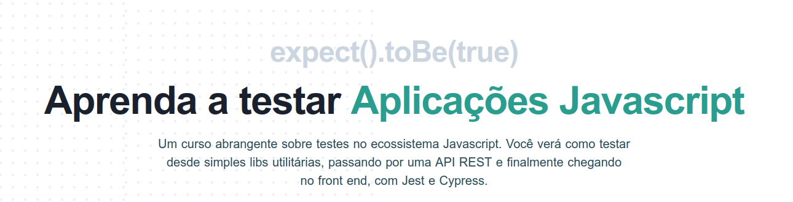

# Curso [Aprenda testar Aplicações Javascript](https://javascript.tv.br/)

:hammer_and_wrench: Arquivos de estudo do curso Aprenda a Testar Aplicações Javascript

  

Autor: [Fábio Vedovelli](https://twitter.com/vedovelli74)

Link: https://javascript.tv.br/

## Módulos

**Módulo 1: Introdução aos testes no Javascript**

- Porque testar e o que testar
  - Tipos de testes
    - Unitários
    - Integração
    - End to End (E2E)
    - Pirâmide de testes
  - Como os testes garantem a integridade da aplicação
    - Github Actions
    - CI/CD
  - Ferramentas
    - Jest
    - Cypress
  - Libraries
    - Testing Library
    - Vue Test Utils
    - Enzyme
  - Projeto 1 - Pequena Lib e uma classe
    - Criar projeto, instalar e configurar o Jest
    - Desenvolver com TDD uma lib para fazer parse de Query String
    - Desenvolver com TDD uma classe para gerenciar um carrinho de compras

**Módulo 2: Testar aplicações front end**

- Projeto 2 - Vue.js/Nuxt
  - Fazer o clone do repositório e instalar as dependências
  - Visão geral do projeto e suas dependências
  - Criar um servidor Mirage.js para dar suporte aos casos de teste
  - Avaliar as ferramentas específicas para o Vue
    - Vue Test Utils
    - Testing Library/Vue
  - Testar componentes de forma isolada (Unit Testing)
  - Testar componentes container (Integration Testing)
  - Testar a aplicação completa (E2E Testing)

**Módulo 3: Testar aplicações front end**

- Projeto 3 - React/Next
  - Fazer o clone do repositório e instalar as dependências
  - Visão geral do projeto e suas dependências
  - Criar um servidor Mirage.js para dar suporte aos casos de teste
  - Avaliar as ferramentas específicas para o React
    - Testing Library/React
  - Testar componentes de forma isolada (Unit Testing)
  - Testar componentes container (Integration Testing)

**Módulo 4: Testar Aplicações Server Side**

- Projeto 4 - Node.js/Express/SQLite
  - Fazer o clone do repositório e instalar as dependências
  - Visão geral do projeto e suas dependências
  - Neste projeto nos aprofundaremos em mocking

**Módulo 5: Garantir que os testes protejam sua aplicação**

- Projeto 5 - Github Actions/CircleCI
  - Utilizar Github Actions para evitar que Pull Requests possam ser incorporados sem que todos os testes passem
  - Integração com CircleCI
